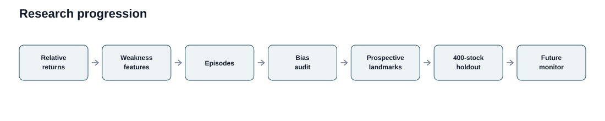
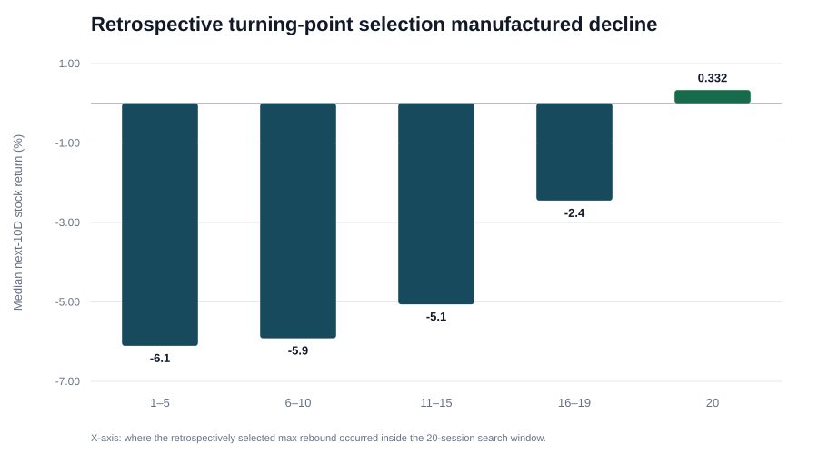
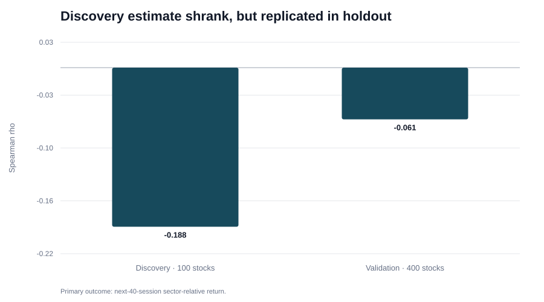
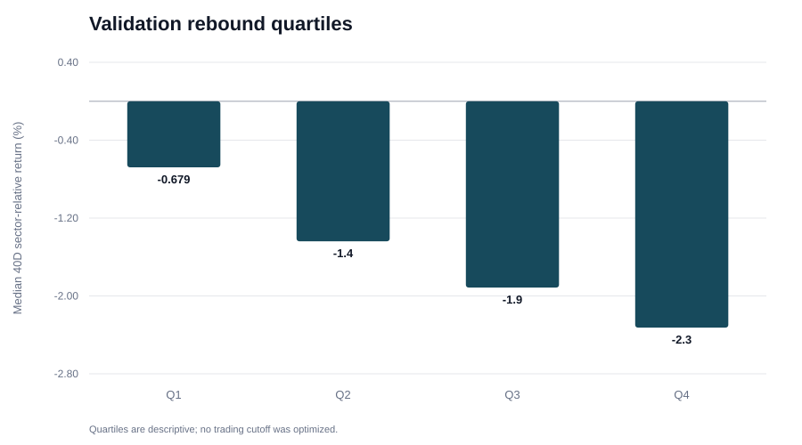
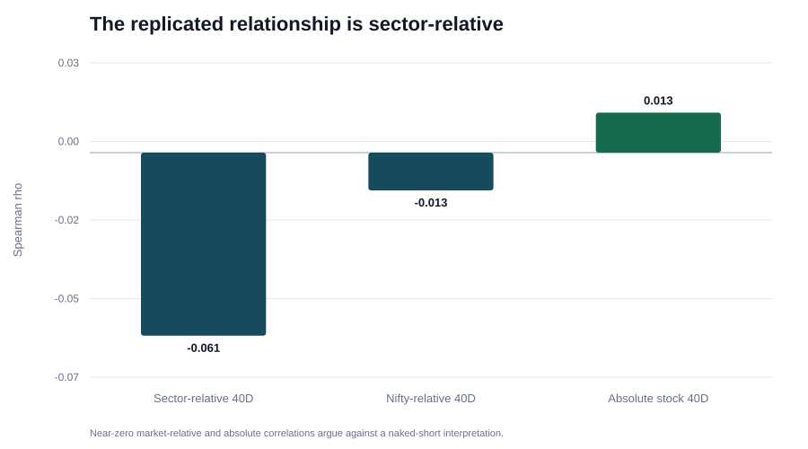

# Research Figure Pack

These figures summarize the main methodological and validation results. The interactive version is built under `docs/` for the public research dashboard.

## Research progression

The project moved from relative-return measurement to weakness features, episode construction, a hindsight-bias audit, fixed prospective landmarks, a locked 400-stock cross-sectional holdout, and finally future-time prospective monitoring.

## Rejected retrospective result

An early analysis selected the maximum rebound inside a future 20-session window and then measured returns after that selected maximum. The apparent post-rebound decline weakened as the selected maximum moved toward the end of the selection window and disappeared when the maximum occurred on Day 20. The result was therefore rejected as selection-induced rather than retained as alpha.

## Discovery versus validation

The prospectively observable Day-20 candidate had a discovery Spearman correlation of about `-0.188`. In the complete 400-stock holdout, the estimate shrank to about `-0.061` but retained the expected direction and passed the predeclared clustered-validation conditions.

## Validation rebound quartiles

Median 40-session sector-relative performance becomes weaker across rebound quartiles. The quartiles are descriptive and were not used to optimize an entry cutoff.

## Outcome specificity

The replicated relationship is mainly sector-relative. Nifty-relative and absolute-stock correlations are near zero, so the evidence does not support interpreting the result as a simple naked-short signal.
